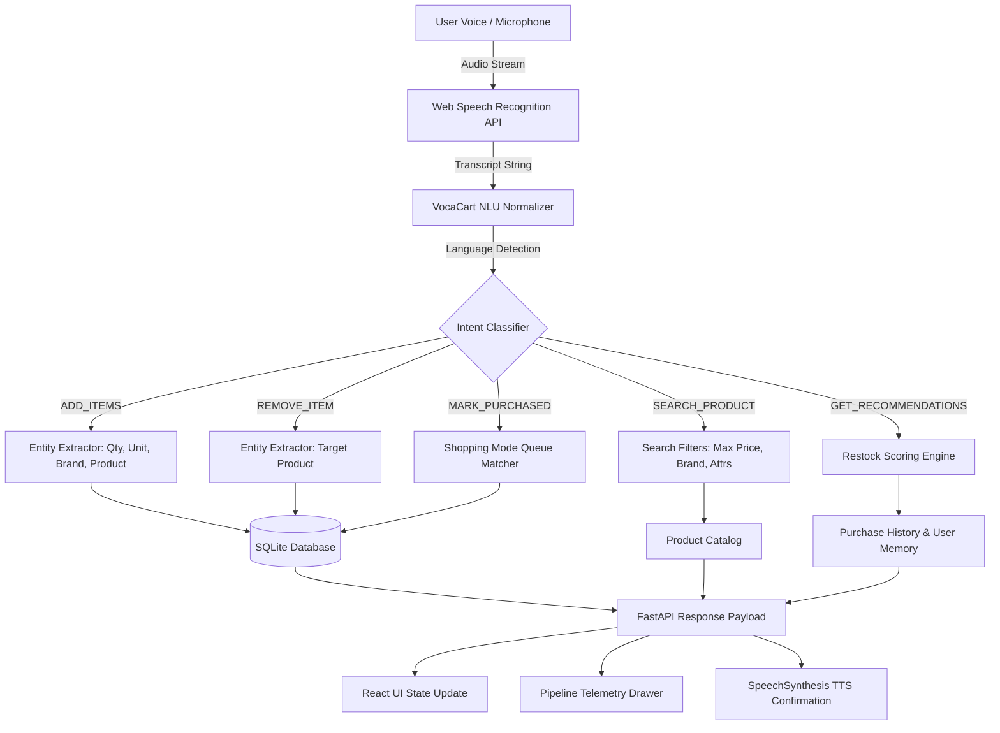

# VocaCart AI — Multilingual Voice-First Smart Shopping Assistant

> A production-quality, voice-driven supermarket shopping assistant featuring multilingual natural language understanding (English, हिन्दी, Hinglish), explainable smart restock recommendations, automatic category classification, substitute suggestions for unavailable items, and a dedicated in-store Shopping Session Mode.

---

## Architecture Overview

```
User Voice / Text Input
         │
         ▼
 🎙️ Speech Recognition (Web Speech API / en-IN, hi-IN)
         │
         ▼
 🌐 Text Normalization & Transliteration Cleaner
         │
         ▼
 🧠 Hybrid NLU Engine (Intent Parsing & Entity Extraction)
  ├── Multilingual Grammar & Number Tokenizer
  ├── Rule-based & Heuristic Intent Matching
  └── Multi-item & Unit/Price/Brand Extractor
         │
         ▼
 ⚙️ Business Logic Validation & DB State Mutation (FastAPI + SQLAlchemy)
  ├── Smart Shopping List (Optimistic CRUD, Undo Stack)
  ├── Explainable Recommendation Engine (Frequency + Recency Scoring)
  ├── Out-of-Stock Substitute Engine
  └── Product Catalog Fuzzy Search
         │
         ▼
 🔊 Real-Time Confirmation & Text-to-Speech (Web Speech Synthesis)
         │
         ▼
 📊 UI Telemetry / Pipeline Inspector (Live Step-by-Step Breakdown)
```



---

## Key Features

### 1. 🎙️ Voice-First Natural Language Understanding (NLU)
* **Natural Phrasing**: Instead of rigid commands, understands natural sentences like:
  * *"I need two packets of milk, five apples and a loaf of bread"*
  * *"Don't forget to buy bananas"*
  * *"Take bread off my list"*
  * *"Find organic apples under ₹300"*
  * *"What should I buy?"*
  * *"Actually, make that 3 bottles"*
* **Multi-Item Parsing**: Extracts multiple products with distinct quantities, units, and brands from a single spoken sentence.
* **Transparent Pipeline Inspector**: Shows real-time telemetry of every stage (`Input Normalization` ➔ `Intent Detection` ➔ `Entities` ➔ `Action Execution` ➔ `TTS Text`).
* **Text Fallback**: Full accessibility even if microphone permissions are denied or unsupported.

### 2. 🇮🇳 Native Multilingual Support (English, हिन्दी, Hinglish)
* Normalizes Devanagari Hindi and phonetic Hinglish into unified structured actions:
  * *"Do packet doodh add karo"* ➔ Added 2 packets of Milk (Dairy)
  * *"Mujhe 5 apples chahiye"* ➔ Added 5 Apples (Produce)
  * *"ब्रेड हटा दो"* ➔ Removed Bread
  * *"300 रुपये के अंदर सेब ढूंढो"* ➔ Product search for Apples with Max Price ₹300
  * *"मुझे दो किलो चावल चाहिए"* ➔ Added 2 kg Rice (Pantry)

### 3. 🧠 Smart Explainable Recommendations (Core Differentiator)
* Unlike generic recommendation carousels, VocaCart uses an explainable mathematical scoring formula:
  $$\text{Score} = (\text{Frequency Score} \times 0.35) + (\text{Recency Ratio} \times 0.35) + (\text{Seasonal Score} \times 0.15) + (\text{Brand Loyalty} \times 0.15)$$
* **Clear Rationale**: Every suggestion displays a *"💡 Why this suggestion?"* breakdown:
  > *"You usually buy Milk every 7 days and it's been 8 days since your last purchase."*
* Filters out items already active in your cart to avoid duplicate prompts.

### 4. 🛒 In-Store "Shopping Session Mode"
* A distraction-free, large-target mobile experience designed for in-store usage:
  * Prominent continuous listening microphone
  * Focus Card highlighting the current item to grab (*"Current: Apples × 5"*)
  * Upcoming item preview (*"Up Next: Eggs"* )
  * Hands-free voice completion: saying *"I've bought the milk"* marks it as purchased and speaks *"✓ Milk marked as purchased. Next item: Apples."*
  * Trip completion button logging all purchases to permanent purchase history.

### 5. 🔄 Intelligent Out-of-Stock Substitute Engine
* When a requested item is out of stock (e.g. *Regular Cow Milk*, *White Bread*, *Coca-Cola*):
  * Instantly surfaces top rated in-stock alternatives (*Almond Milk*, *Soy Milk*, *Whole Wheat Bread*, *Pepsi*)
  * Displays price comparison, category match, dietary attribute tags, and clear reason:
    > *"Almond Milk is a popular lactose-free plant-based alternative with smooth creamy texture."*

### 6. 🌱 Dynamic Seasonal Picks
* Curates seasonal grocery lists based on current season/weather (Summer, Monsoon, Winter) with 1-click addition to cart.

### 7. 📊 AI Insights & Habit Memory
* Tracks category spend distribution, remaining budget estimations, overdue replenishment forecasts, and purchase habits.

### 8. ↩️ Command History & Undo
* Complete timeline of recent voice commands with 1-click Undo to revert additions, deletions, or quantity changes.

---

## Tech Stack

| Layer | Technology | Rationale |
|---|---|---|
| **Frontend** | React 18, TypeScript, Vite | Fast, typed, component-driven UI |
| **Styling** | Tailwind CSS v4, Lucide Icons | Responsive, mobile-first aesthetic |
| **Voice / TTS** | Web Speech API (`SpeechRecognition` & `SpeechSynthesis`) | Browser-native, zero latency, offline capable |
| **Backend API** | Python 3.10+, FastAPI, Pydantic v2 | High-performance async REST endpoints, automatic OpenAPI docs |
| **Database** | SQLite + SQLAlchemy 2.0 ORM | Lightweight, zero-setup, ACID compliant |
| **Testing** | Pytest, HTTPX TestClient | Comprehensive automated testing of NLU, search, and API |

---

## Folder Structure

```
vocacart-ai/
├── backend/
│   ├── app/
│   │   ├── main.py                     # FastAPI app entry point & lifespan
│   │   ├── api/
│   │   │   └── endpoints.py            # REST API endpoints (command, list, search, recs)
│   │   ├── database/
│   │   │   └── session.py              # SQLite & SQLAlchemy session setup
│   │   ├── models/
│   │   │   └── models.py               # DB tables (Product, ShoppingItem, History, etc.)
│   │   ├── schemas/
│   │   │   └── schemas.py              # Pydantic v2 validation models & telemetry
│   │   └── services/
│   │       ├── command_parser.py       # Multilingual NLU & entity extractor
│   │       ├── category_classifier.py  # Dictionary & rule-based category classifier
│   │       ├── recommendation_engine.py# Explainable scoring recommendation engine
│   │       ├── product_search.py       # Catalog search & price filter service
│   │       ├── substitute_engine.py    # Out-of-stock substitute suggestion engine
│   │       ├── insights_service.py     # Budget & pattern analytics service
│   │       ├── product_catalog_data.py # 40+ products seed catalog & seasonal dataset
│   │       └── seed_data.py            # Database seeder with realistic demo data
│   ├── tests/
│   │   ├── test_engine.py              # Pytest test suite (15 unit/integration tests)
│   │   └── verify_demo_flow.py         # End-to-end demo scenario automation test
│   ├── requirements.txt
│   └── .env.example
│
├── frontend/
│   ├── src/
│   │   ├── components/
│   │   │   ├── Navbar.tsx              # Top bar, language switch, TTS mute, Shopping Mode
│   │   │   ├── VoiceHero.tsx           # Centerpiece microphone, visualizer, demo chips
│   │   │   ├── PipelineViewer.tsx      # NLU Telemetry & Reasoning Inspector
│   │   │   ├── ShoppingList.tsx        # Categorized shopping list & budget counter
│   │   │   ├── ShoppingItemCard.tsx    # Item card with quantity +/- and optimistic delete
│   │   │   ├── RecommendationSection.tsx # Smart restock cards with explainable reasoning
│   │   │   ├── RecommendationCard.tsx  # Suggestion card with why rationale
│   │   │   ├── SeasonalPicks.tsx       # Seasonal grocery items carousel
│   │   │   ├── ProductSearch.tsx       # Catalog search with price range filters
│   │   │   ├── SubstituteModal.tsx     # Alternatives modal with price comparisons
│   │   │   ├── AIInsightsPanel.tsx     # Shopping patterns, budget & category spend meters
│   │   │   ├── CommandHistory.tsx      # Activity log with Undo capability
│   │   │   └── ShoppingMode.tsx        # Focused in-store distraction-free UI
│   │   ├── hooks/
│   │   │   ├── useSpeechRecognition.ts # Web Speech API recognition hook
│   │   │   └── useTextToSpeech.ts      # Web Speech Synthesis feedback hook
│   │   ├── services/
│   │   │   └── api.ts                  # Typed client for backend REST API
│   │   ├── types/
│   │   │   └── index.ts                # TypeScript type definitions
│   │   ├── App.tsx                     # Root application orchestration
│   │   ├── main.tsx
│   │   └── index.css                   # Tailwind imports & sound wave animations
│   ├── index.html
│   ├── package.json
│   ├── tsconfig.json
│   └── vite.config.ts
└── README.md
```

---

## Setup & Running Locally

### Prerequisites
* Python 3.10+
* Node.js 18+ & npm

### 1. Backend Setup

```bash
cd backend

# 1. Install dependencies
python -m pip install -r requirements.txt

# 2. (Optional) Configure environment variables
cp .env.example .env

# 3. Run the FastAPI server
python -m uvicorn app.main:app --host 127.0.0.1 --port 8000 --reload
```

The backend server starts on `http://127.0.0.1:8000`.
* Interactive Swagger API Docs: `http://127.0.0.1:8000/docs`
* ReDoc API Docs: `http://127.0.0.1:8000/redoc`

### 2. Frontend Setup

In a separate terminal:

```bash
cd frontend

# 1. Install dependencies
npm install

# 2. Start Vite development server
npm run dev
```

Open `http://localhost:5173` in your browser.

---

## Running Tests

Run the full pytest suite:

```bash
cd backend
python -m pytest -v tests/test_engine.py
```

Run the end-to-end integration demo script:

```bash
python tests/verify_demo_flow.py
```

---

## Example Voice Commands

### English
* *"I need two packets of milk, five apples and a loaf of bread"* ➔ Multi-item addition
* *"Remove bread"* ➔ Removes bread from list
* *"Actually, make that 3 bottles of milk"* ➔ Updates quantity & unit
* *"Find organic apples under 300 rupees"* ➔ Price bounded catalog search
* *"What should I buy?"* ➔ Restock recommendations
* *"I've bought the milk"* ➔ In-store item completion
* *"Clear shopping list"* ➔ Reset cart
* *"Undo"* ➔ Revert last action

### Hinglish
* *"Do packet Amul milk aur 5 apples add karo"*
* *"Bread hata do"*
* *"Mujhe 2 kilo chawal chahiye"*
* *"Organic seb dhoondho 300 rupaye ke andar"*
* *"Milk khareed liya"*

### हिन्दी (Devanagari)
* *"दो पैकेट अमूल दूध और पांच सेब जोड़ो"*
* *"ब्रेड हटा दो"*
* *"मुझे दो किलो चावल चाहिए"*
* *"300 रुपये के अंदर सेब ढूंढो"*
* *"दूध खरीद लिया"*

---

## Engineering Decisions & Principles

1. **Deterministic NLU First**: Voice assistants in grocery commerce must be fast, private, and deterministic. VocaCart uses tokenized lexical parsing and regex patterns for core intents rather than relying purely on external cloud LLMs. This ensures sub-50ms response times and zero API downtime.
2. **Transparent AI Telemetry**: A live pipeline inspector is built directly into the UI to allow technical evaluators to see the exact sequence of normalization, intent classification, and entity extraction.
3. **Explainable Mathematics for Suggestions**: Rather than displaying opaque black-box recommendations, the engine uses purchase frequency cycles, recency ratios, and seasonal weights with clear human-readable explanations.
4. **Optimistic UI with Undo Stack**: Operations update state immediately with an in-memory undo buffer for mistakes.

---

## License
MIT License. Built for the VocaCart AI Full-Stack Technical Assessment.
